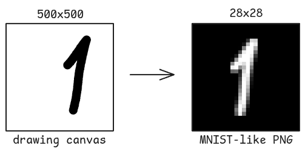

# TamingAI

[](https://gohugo.io/)
[](https://opensource.org/licenses/MIT)

> An educational project about the technology of neural networks powered by [Hugo](https://github.com/gohugoio/hugo).

**[Demo →](https://taming-ai.net/)**


# About

Consisting of two chapters, it covers the building blocks
of a typical machine learning algorithm and explains how
to apply them to the real project.

We also include our [own](https://github.com/LookTheLock/NeuralNetwork) simple neural network
that is made to classify handwritten digits using the
[MNIST](https://de.wikipedia.org/wiki/MNIST-Datenbank) dataset.

The algorithm itself is written from the ground up in `C++`.
Therefore, we did **not** use any external libraries to build
neural networks such as [OpenNN](https://www.opennn.net/), [Dlib](https://dlib.net/) etc.

TamingAI is ideal for people who don't only want to learn
about how to use AI, but also **how it works** under the hood.

Learn more and contribute on GitHub: [NeuralNetwork](https://github.com/LookTheLock/NeuralNetwork).

The code base consists of three parts:
1. [The static website](#The static website)
2. [Server side image parsing](#Server side image parsing)
3. [Neural network image classifier](#Neural network image classifier) (the AI part)


# The static website

The website just consists of static HTML webpages, so we
used the static site generator [Hugo](https://gohugo.io/).


## Quick Start

### Prerequisites
- Hugo >= **0.158.0** ([Download Hugo](https://gohugo.io/installation/))
- Git

### Try It Out
```bash
# Clone the repository
git clone https://github.com/LookTheLock/TamingAI
cd TamingAI/Website

# Start the development server
hugo server

# Open http://localhost:1313/ in your browser
```


# Server side image parsing

As you may have noticed, there is a `canvas` on the home page. The
code for the client side is in
`Website/themes/HugoTeX/layouts/_partials/canvas.html`.

There we have the `upload()` function. It makes a copy of the drawing
`canvas`, resizes it to be `28x28`, then sends the bitmap of the
image to the server.

On the server there is this `parsing.sh.cgi`
bash script that receives the data via `stdin`.
See code at: `cgi-bin/parsint.sh.cgi`.

What the script does is to use [ImageMagick](https://imagemagick.org/)
to convert the canvas PNG to match the [MNIST image format](https://github.com/myleott/mnist_png).




Notes on the setup:
> On the server (a Linux machine) runs an HTTP server, specifically [Lighttpd](https://redmine.lighttpd.net/projects/lighttpd/wiki). The HTTP server *serves* the HTML pages to your browser, but it can also allow calls to the server directly. For that we have used CGI (The Common Gateway Interface [RFC3875](https://datatracker.ietf.org/doc/html/rfc3875)). You do it by [adding](https://redmine.lighttpd.net/projects/lighttpd/wiki/Docs_ConfigurationOptions) the [Lighttpd's CGI-Module](https://redmine.lighttpd.net/projects/lighttpd/wiki/Mod_cgi) to your [config](https://redmine.lighttpd.net/projects/lighttpd/wiki/TutorialConfiguration) file.


# Neural network image classifier

Now, the [ready image](#Server side image parsing) gets piped
to the `NeuralNetwork` executable.

The source is written in `C++`. See code at `NeuralNetwork/`

In `stdin` comes the bitmap of the parsed image.
It gets decoded and put into a matrix.
Then we load the `ClassifierNetwork` from a pretrained net.
> ...Simon, ich weiß nicht, wie das Ding genau funktioniert...

And finaly predict the image.

Crutialy, the output to `stdout` has the following format:
```
Content-Type: text/plain


2
```
We specefy the content type with `Content-Type: text/plain` and
leave **two black lines**. This is the format CGI needs.

The details on math behind how this all works is the wole
purpose of the project. So if you are interested visit [TamingAI.net](https://taming-ai.net/)


# Contributing
Contributions are welcome! To contribute:
1. Fork this repository.
2. Create a new branch:
   ```bash
   git checkout -b feature-name
   ```
3. Commit your changes:
   ```bash
   git commit -m "Add a new feature"
   ```
4. Push to the branch:
   ```bash
   git push origin feature-name
   ```
5. Open a pull request.

# License

MIT License - see [LICENSE](LICENSE) for details

# Acknowledgments
TamingAI makes use of a variety of open source projects including:

* https://github.com/phoebetronic/mnist
* https://github.com/gohugoio/hugo
* https://github.com/KaTeX/KaTeX
* https://github.com/vincentdoerig/latex-css
* https://github.com/hugotex-dev/HugoTeX
* https://reintech.io/blog/custom-drawing-application-html5-canvas-javascript
